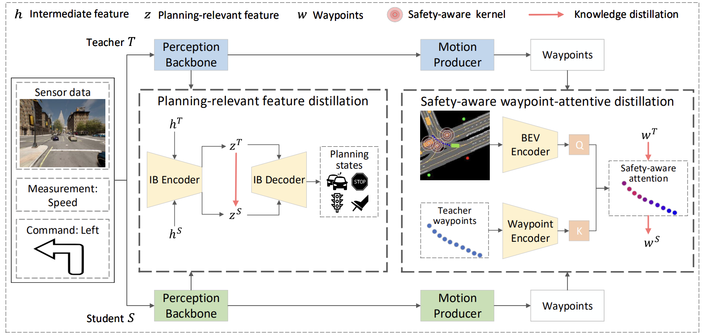

# PlanKD: Compressing End-to-End Motion Planner for Autonomous Driving (CVPR 2024)


## Introduction

This repository contains the code for paper: [On the Road to Portability: Compressing End-to-End Motion Planner for Autonomous Driving](https://arxiv.org/abs/2403.01238). This paper is accepted by CVPR 2024. 

**TL;DR**:  We propose PlanKD, the first knowledge distillation framework tailored for compressing end-to-end motion planning models in autonomous driving.





## Setup

Clone the repo and build the python environment.

```bash
git clone https://github.com/tulerfeng/PlanKD.git
conda env create -f environment.yml
conda activate plankd
```

Download and setup CARLA 0.9.10.1 environment referring to the related instructions in [InterFuser](https://github.com/opendilab/InterFuser?tab=readme-ov-file) or [TCP](https://github.com/OpenDriveLab/TCP) .


## Dataset Generation

We provide the scripts for the dataset generation in the `dataset` folder and the `data_collection` folder. Please refer to [InterFuser](https://github.com/opendilab/InterFuser?tab=readme-ov-file) or [TCP](https://github.com/OpenDriveLab/TCP) for the instructions of dataset generation.  Note that it's unnecessary to run all the scripts for data collection. You can choose to run them selectively, such as collecting data uniformly across different towns and weather conditions.

We also provide the a tiny dataset for demonstration which could be downloaded at [here](https://drive.google.com/file/d/14G49BzOGp4tmJvCFxCuhd8A-_bM8YZat/view?usp=sharing).  On this tiny demo dataset, InterFuser (26.3M) obtains 36.52 / 25.54 driving score with / without PlanKD on Town05 Short.


## Training

Train the teacher InterFuser (52.9M) model.

```
cd ./interfuser
bash scripts/train.sh interfuser_baseline
```

We also provide an example teacher model for direct use which could be downloaded at [here](https://drive.google.com/file/d/19IOwQoNtCMg36aWsshicJHgH-FtcWdDz/view?usp=sharing).  Put the checkpoint of teacher model under the `interfuser/output` folder.

Train the student InterFuser (26.3M) model without PlanKD.

```
bash scripts/train.sh interfuser_baseline2
```

Train the student InterFuser (26.3M) model with PlanKD.

```
bash scripts/train_plankd.sh interfuser_baseline2
```

The InterFuser student models, with parameter counts of 26.3M, 11.7M, and 3.8M, are respectively termed as interfuser_baseline2, interfuser_baseline4, and interfuser_baseline5. The core code of PlanKD is in`interfuser/plankd.py`.


## Evaluation

Launch the CARLA server.

```
SDL_VIDEODRIVER=offscreen ./CarlaUE4.sh -carla-world-port=2000 -opengl
```

Modify the configuration in `/leaderboard/scripts/run_evaluation.sh` file.

Run the evaluation. 

```
SDL_VIDEODRIVER="dummy" ./leaderboard/scripts/run_evaluation.sh
```

For the evaluation of TCP models, please refer to the related code in [TCP](https://github.com/OpenDriveLab/TCP) since its agent config is different from InterFuser. 


## Trained Weights

We also provide the trained student model weights by PlanKD for direct evaluation,  which could be downloaded at [here](https://drive.google.com/file/d/1ls4I5XEEDEWRmuAEfvpQXCSwszlg-UxJ/view?usp=sharing). 


## Acknowledgement

This implementation is based on code from several repositories.

+ [InterFuser](https://github.com/opendilab/InterFuser?tab=readme-ov-file) 
+ [TCP](https://github.com/OpenDriveLab/TCP)

## Citation

If you find our repo or paper useful, please cite us as

> ```
> @inproceedings{fengtowards,
>   title={Towards Open Temporal Graph Neural Networks},
>   author={Feng, Kaituo and Li, Changsheng and Zhang, Xiaolu and ZHOU, JUN},
>   booktitle={International Conference on Learning Representations}
> }
> ```

## License

All code within this repository is under [Apache License 2.0](https://www.apache.org/licenses/LICENSE-2.0).